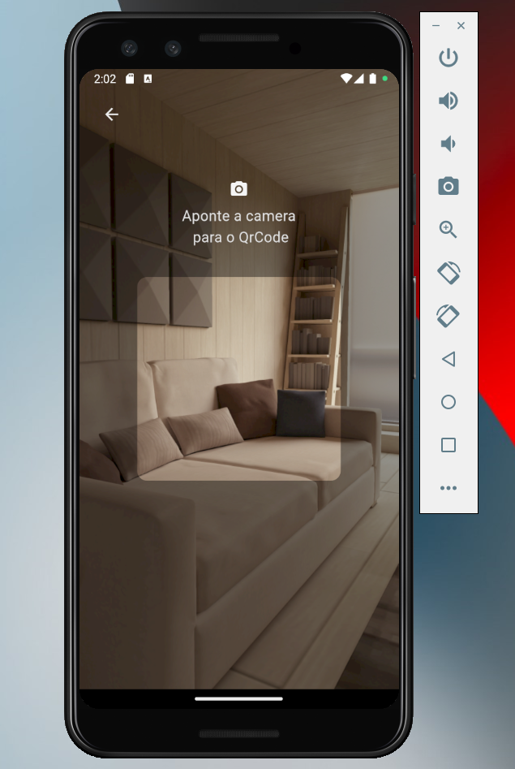

# Qr scanner like a nubank

A Flutter project that implements a Nubank library to scan QR codes with a guide overlay to help the user.

The code is organized using mvvm architecture.

- nubank lib repository
  https://github.com/nubank/mobile_scanner

- pub.dev
  https://pub.dev/packages/mobile_scanner

  ## Getting start

**With flutter installed and a device emulator enabled**, Just run in the terminal:

```
flutter run
```


